# 母婴电商购物行为数据分析

> 基于阿里天池「淘宝母婴购物数据集」的端到端数据分析项目：**数据质量体检 → 业务指标 → 可视化 → 机器学习建模 → 运营建议**

[](https://www.python.org/)
[](https://pandas.pydata.org/)
[](https://scikit-learn.org/)
[](./LICENSE)
[](./data/README.md)

---

## 项目简介

分析一个母婴电商平台 **2012.07 – 2015.02** 的 29,971 条交易记录，回答六个业务问题：

| 业务问题 | 分析方向 | 核心产出 |
| :--- | :--- | :--- |
| 生意在增长吗？节奏如何？ | 时间维度 | 年度 +19.9%，双11 拉动 5.19 倍 |
| 卖什么？结构健康吗？ | 品类结构 | 尿裤/奶粉贡献 62% 件数，CR10 仅 44.5% |
| 用户怎么买？ | 购买量分布 | 88% 订单只买 1 件，极端长尾 |
| 有没有异常数据？ | 异常识别 | 0.03% 订单贡献 27.5% 件数 |
| 谁在买？ | 宝宝画像 | 月龄显著影响品类，性别无影响 |
| 能否预测行为？ | 机器学习 | 囤货预测 ROC-AUC 0.778 |

📄 **完整可视化报告：[`reports/report.html`](./reports/report.html)**（自包含单文件，可直接浏览器打开）

---

## 项目亮点

### 1️⃣ 先做「可行性判断」，再动手分析

拿到数据后第一步是质量体检，结论直接决定了分析边界的划定：

```
交易记录 29,971 条  ←→  唯一用户 29,944 个      人均仅 1.0009 笔
其中带性别标签的用户 929 个，人均可用交易记录 1.0 条
```

这份样本是**按行随机抽样**的，不是用户行为序列。因此本项目**主动放弃**了 RFM、复购周期、
用户生命周期、性别预测等依赖「单用户多记录」的分析——而不是硬做出一堆看似完整、实则无效的结果。

> 我们对经典的「性别预测」赛题做了实测：**ROC-AUC = 0.4931**，与随机猜测（0.5）无异。
> 与其交一个能跑但无意义的模型，不如把精力投到数据能支撑的问题上。

### 2️⃣ 抓到了一条关键的数据质量问题

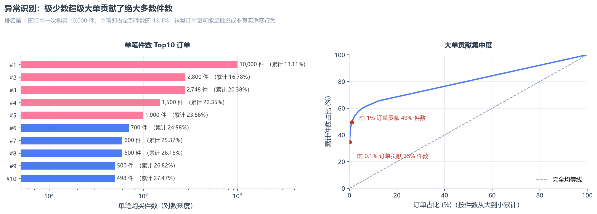

单笔最高 **10,000 件**（童装/童鞋），一笔即占全部件数的 **13.1%**；**Top10 大单合计占 27.5%**。

这意味着项目里所有「平均值」类指标都必须给出**含/不含大单两个口径**，否则结论会被极少数订单绑架。
（剔除 Top10 后，平均单笔件数从 2.54 件降到 1.85 件。）

### 3️⃣ 用数据推翻了一个「行业常识」

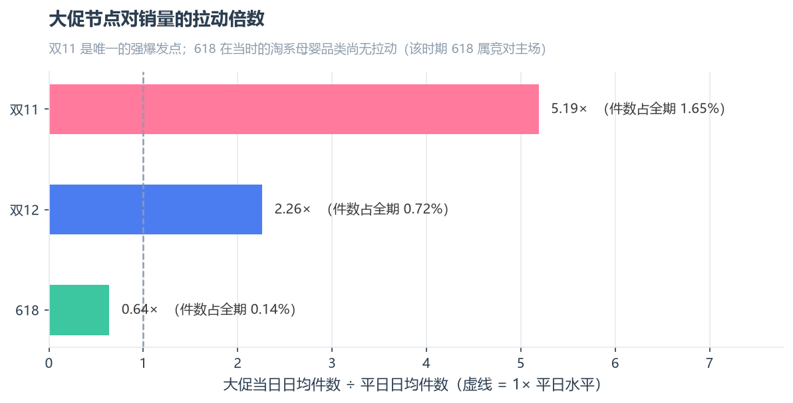

**双11 拉动 5.19 倍，双12 拉动 2.26 倍，而 618 只有 0.64 倍**（低于平日水平）。

在 2012–2014 年的淘系母婴品类中，618 尚未形成大促心智——该时期 618 是竞对平台的主场。
这说明**行业常识不能直接照搬，必须用数据验证**。

### 4️⃣ 两个品类的运营逻辑完全不同

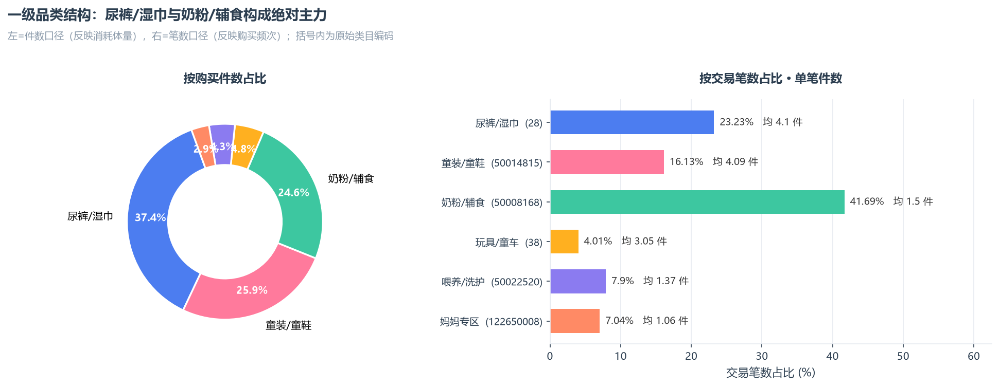

| 品类 | 笔数占比 | 单笔件数 | 购买逻辑 | 运营建议 |
| :--- | ---: | ---: | :--- | :--- |
| 奶粉/辅食 | 41.7% | 1.5 件 | 高频补货，SKU 极度分散（12,046 个） | 订阅制、周期购、补货提醒 |
| 尿裤/湿巾 | 23.2% | **4.1 件** | 低频囤货 | 大包装、组合囤货、满减 |
| 童装/童鞋 | 16.1% | 4.09 件 | 被低估的第二梯队 | 加大类目资源投入 |

同样的「母婴刚需」，一个要**锁复购**，一个要**冲客单**——不能套同一套促销方案。

### 5️⃣ 完成一次规范的机器学习流程

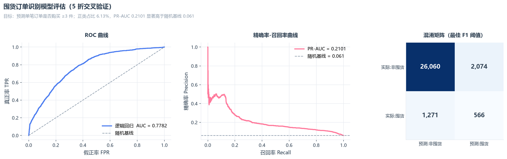

预测「单笔订单是否会囤货（≥3 件）」，正类占比 6.13% 的不平衡分类问题：

- **5 折交叉验证**：ROC-AUC **0.778**、PR-AUC **0.210**（随机基线仅 0.061，提升 3.4 倍）
- **44 维特征**，严格排除 `buy_mount` 相关字段以避免标签泄漏
- 对比逻辑回归与随机森林，并说明**为何最终选择更简单、更可解释的模型**

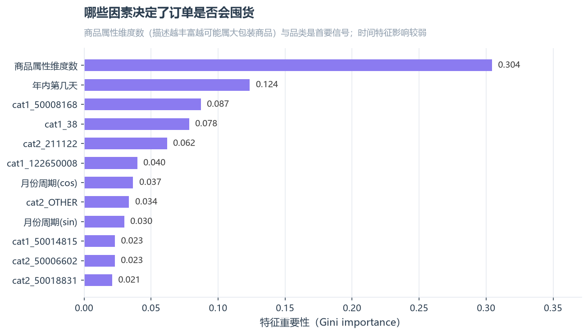

---

## 核心图表

| 月度趋势 | 季节性规律 |
| :---: | :---: |
| 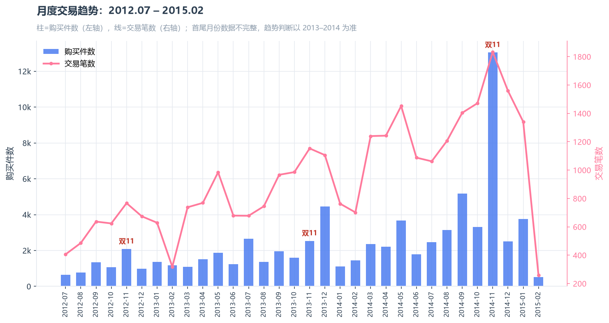 | 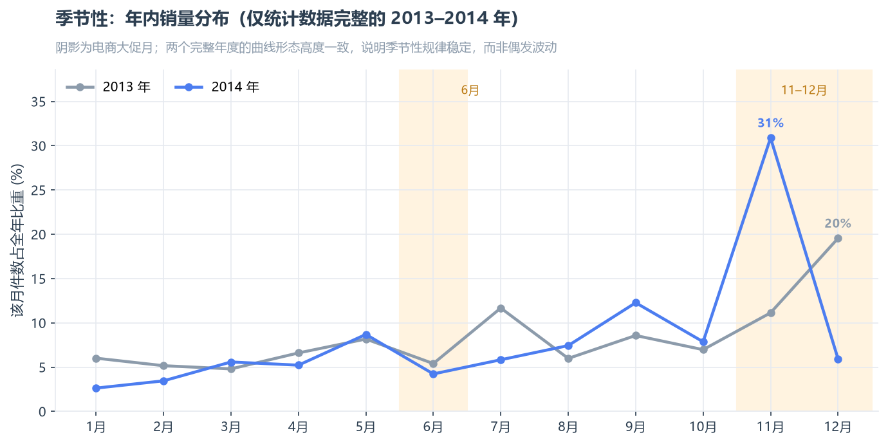 |

| 购买量长尾分布 | 月龄 × 品类偏好 |
| :---: | :---: |
| 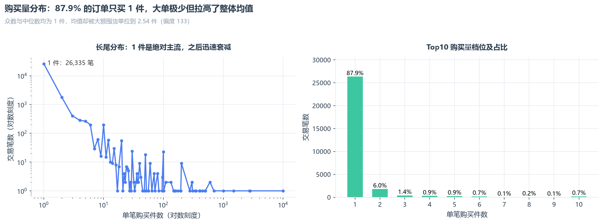 | 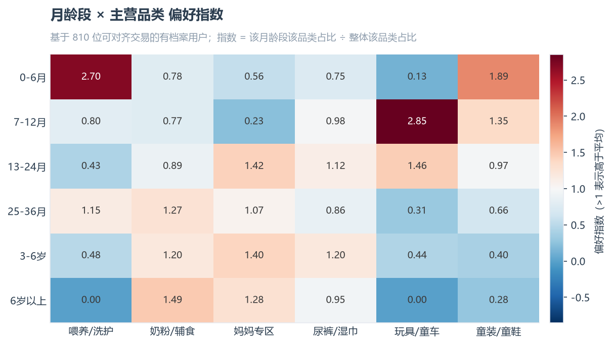 |

| 二级类目帕累托 | 性别假设检验 |
| :---: | :---: |
| 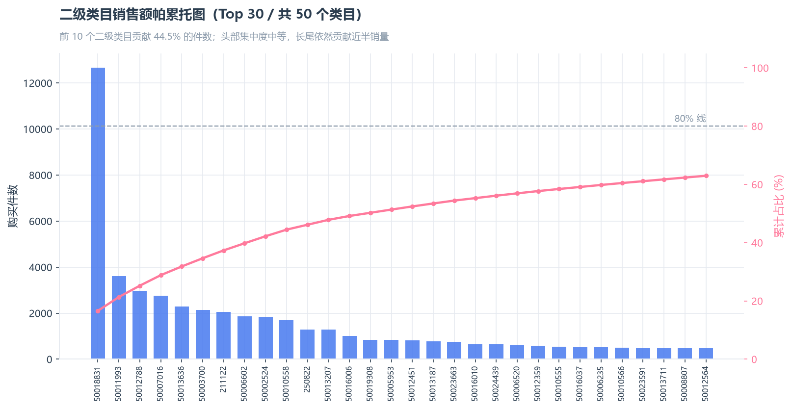 | 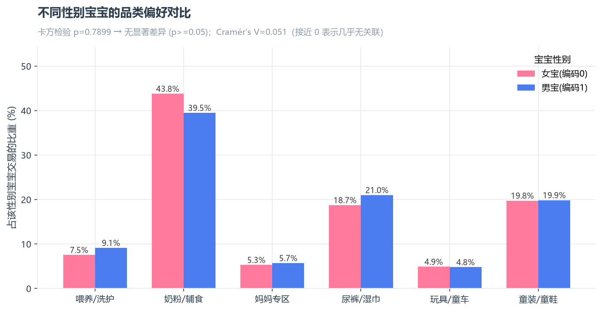 |

<details>
<summary>查看全部 16 张图表清单</summary>

| 编号 | 文件名 | 内容 |
| --- | --- | --- |
| 01 | `fig01_monthly_trend.png` | 月度交易趋势（2012.07–2015.02） |
| 02 | `fig02_seasonality.png` | 年内月度销量分布（2013 vs 2014） |
| 03 | `fig03_weekday.png` | 周内下单分布 |
| 04 | `fig04_promo_effect.png` | 大促节点拉动倍数 |
| 05 | `fig05_cat1_share.png` | 一级品类结构（件数 vs 笔数） |
| 06 | `fig06_pareto.png` | 二级类目帕累托图 |
| 07 | `fig07_buy_mount_dist.png` | 购买量分布 |
| 08 | `fig08_bulk_by_cat.png` | 各品类囤货倾向 |
| 09 | `fig09_baby_profile.png` | 宝宝出生年份与性别构成 |
| 10 | `fig10_age_category_heatmap.png` | 月龄段 × 品类偏好指数 |
| 11 | `fig11_gender_category.png` | 性别 × 品类偏好与卡方检验 |
| 12 | `fig12_property.png` | 商品属性维度挖掘 |
| 13 | `fig13_year_compare.png` | 完整年度对比 |
| 14 | `fig14_model_eval.png` | 模型评估（ROC / PR / 混淆矩阵） |
| 15 | `fig15_feature_importance.png` | 特征重要性 |
| 16 | `fig16_outliers.png` | 异常订单与贡献集中度 |

</details>

---

## 技术栈

| 环节 | 工具 |
| :--- | :--- |
| 数据处理 | Python 3.13 · pandas · NumPy |
| 统计检验 | SciPy（卡方独立性检验、Cramér's V 效应量） |
| 机器学习 | scikit-learn（Pipeline、StratifiedKFold、LogisticRegression、RandomForest） |
| 可视化 | Matplotlib（16 张定制图表，统一浅色主题与中文字体处理） |
| 报告输出 | 原生 HTML/CSS 生成自包含报告（图片 base64 内嵌） |

---

## 项目结构

```
mum-baby-analysis/
├── data/
│   ├── raw/                      原始数据（公开采样样本）
│   ├── processed/                清洗后数据集（脚本自动生成）
│   └── README.md                 数据字典与口径说明
├── src/                          可复用分析模块
│   ├── config.py                 路径、配色、中文类目字典、matplotlib 全局样式
│   ├── data_loader.py            数据加载 + 质量体检
│   ├── preprocess.py             清洗、时间/属性特征工程、用户画像
│   ├── analysis.py               8 个分析模块的业务指标计算
│   ├── visualize.py              16 张图表的绘制函数
│   ├── modeling.py               特征工程与模型训练/评估
│   └── report.py                 自包含 HTML 报告生成
├── scripts/
│   ├── run_all.py                一键运行完整流程
│   └── build_report.py           生成 HTML 报告
├── notebooks/
│   └── mum_baby_analysis.ipynb   交互式分析笔记（含全部输出）
├── docs/
│   ├── interview_notes.md        项目讲解要点（面试可直接用）
│   └── project_intro.md          项目简介文案包（仓库描述/简历/面试多版本）
└── reports/
    ├── figures/                  16 张图表 PNG
    ├── tables/                   24 份指标明细 CSV
    └── report.html               完整可视化报告
```

---

## 快速开始

```bash
# 1. 安装依赖
pip install -r requirements.txt

# 2. 一键运行完整流程（加载 → 清洗 → 指标 → 绘图 → 建模，约 20 秒）
python scripts/run_all.py

# 3. 生成 HTML 报告
python scripts/build_report.py
```

运行完成后，所有图表输出到 `reports/figures/`，所有指标明细输出到 `reports/tables/`。

也可以直接打开 `notebooks/mum_baby_analysis.ipynb` 逐步查看分析过程。

---

## 分析框架

```
                    ┌─────────────────────────┐
                    │   数据质量体检            │
                    │  样本结构 / 缺失 / 异常    │
                    └───────────┬─────────────┘
                                │
                ┌───────────────┼───────────────┐
                ▼               ▼               ▼
        ┌─────────────┐ ┌─────────────┐ ┌─────────────┐
        │  时间维度    │ │  品类维度    │ │  用户维度    │
        │ 趋势/季节/大促│ │ 结构/集中度  │ │ 宝宝画像/偏好 │
        └──────┬──────┘ └──────┬──────┘ └──────┬──────┘
               └───────────────┼───────────────┘
                               ▼
                    ┌─────────────────────────┐
                    │   异常识别 + 假设检验     │
                    │ 大额订单 / 卡方检验       │
                    └───────────┬─────────────┘
                                ▼
                    ┌─────────────────────────┐
                    │   机器学习建模            │
                    │  囤货行为预测            │
                    └───────────┬─────────────┘
                                ▼
                    ┌─────────────────────────┐
                    │   运营建议                │
                    └─────────────────────────┘
```

---

## 主要结论

1. **大促资源集中在 11 月**：11 月贡献全年约 31% 的件数，双11 单日拉动 5.19 倍；618 在当期无拉动效应，不建议按年度节点投入。
2. **尿裤与奶粉需要两套运营逻辑**：尿裤（单笔 4.1 件）做囤货型促销，奶粉（单笔 1.5 件、12,046 个 SKU）做订阅制锁复购。
3. **建立大额订单监控口径**：0.03% 的订单贡献 27.5% 件数，核心 KPI 建议改用订单数/用户数为主口径。
4. **按月龄而非性别做推荐**：月龄对品类偏好影响显著（7–12 月玩具偏好指数 2.85），而性别无统计显著影响（p=0.79）。
5. **囤货可预测**：模型的 PR-AUC 是随机基线的 3.4 倍，可用于库存预占与包材准备。

---

## 数据来源与致谢

- 数据集：[阿里云天池 · 淘宝母婴购物数据集（Baby Goods Info Data）](https://tianchi.aliyun.com/dataset/45)
- 数据由淘宝 / 天猫提供，已脱敏抽样，仅用于学习与作品展示
- 详细字段说明与口径提示见 [`data/README.md`](./data/README.md)

## 局限性

- 样本为按行抽样的子集（人均 1.0 笔交易），**用户级行为分析不成立**
- 无成交金额字段，所有规模结论均为**件数口径**，不等同于 GMV
- 类目名与属性键已被平台脱敏，分析表述保持克制
- 仅 2013、2014 为完整年度，趋势分析限定于此区间

## License

[MIT](./LICENSE) © 2026
